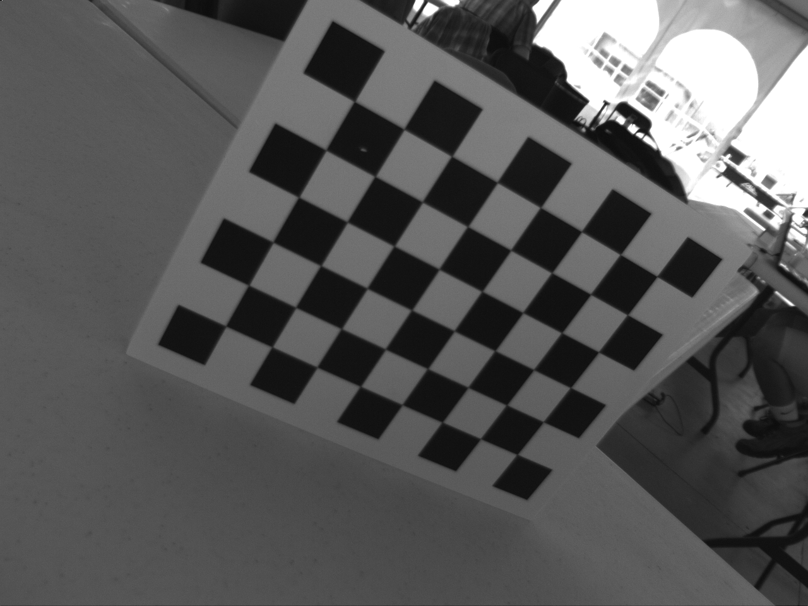
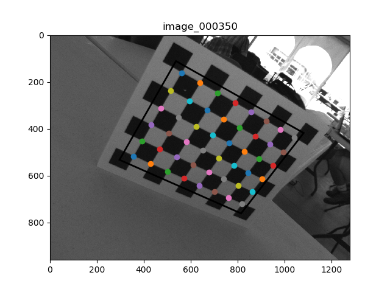
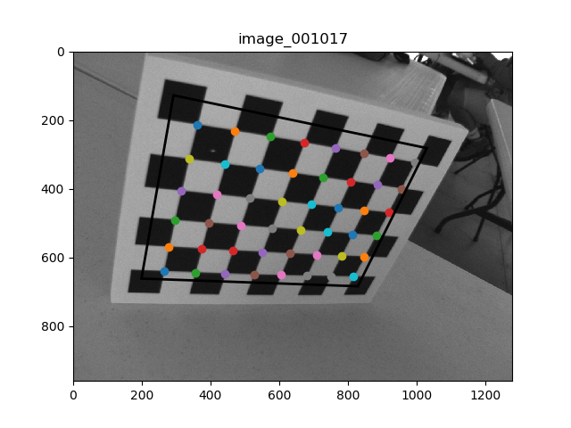
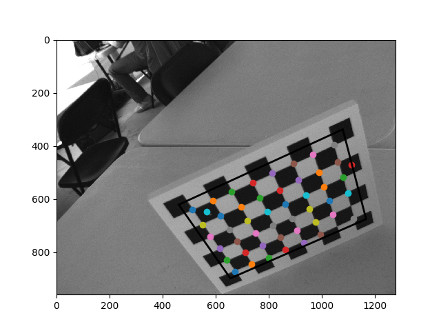

# Project Description:
The goal of this project was to detect the cross-junctions on various distorted
checkerboard target images with sub-pixel precision. The following image is an example of one of the target
images that the algorithm performed on:

*Figure 1: Example Target Image*

All of the targets used for this project are contained in the targets folder. Each target
is accompanied by a bounding box that surrounds the checkerboard. This allows us to make 
more accurate predictions of the locations of the cross-junctions.

## Method:
Each checkerboard was smoothed over using a Gaussian filter to smooth out false 
cross-junctions. Then, a manual implementation of a Harris Corner detector was used.
The Harris Corner detector gave an approximation of the cross-junctions of each image. 
To refine the cross-junction estimates, image splices near each cross-junction were
considered. Each image of a cross-junction can be represented as a hyperbolic paraboloid.
The saddle point of the hyperbolic paraboloid that describes each image is precisely the
cross-junction point. This cross-junction point can be found be solving a linear least 
squares problem. 

## Results:
The results of the algorithm are detailed in the results folder. The following figures
are some examples:

*Figure 2: Result Example 1*

*Figure 3: Result Example 2*

*Figure 4: Result Example 3*
